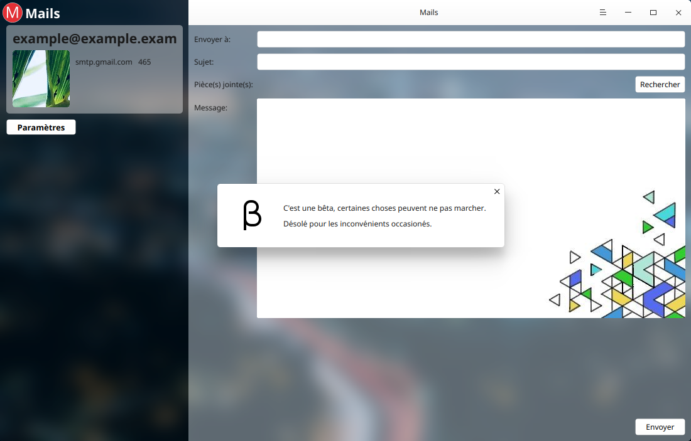

# Mail project for Deepin (designed for) #

        'Mails' (or 'Mail') is a beta of mail services based, for the moment on the SMTP system.

Please note the fact that this is a beta, a project in development, some things can don't work as expected (...). If you want to help this project and improve it, open an issue and put as title "(DEIH-Ask) Development, Enhance, Improvement and Help". This project is under GPU 3.0 License, Like all the other projects I have.



## Dependencies
To build this project, you need the following developer packages (if there is):

*From dde-desktop:*
```
- libdtkcore
- libdtkwidget
- libdtkwm
```
*From Qt:*
```
- libqt5sql5
- libqt5sql5-mysql
- libqt5sql5-sqlite
- libqt5network5
- libqt5network5
- libqt5dbus
- libqt5linguisttools
- libqt5webkit5
- libqt5svg5
- ibqt5keychain
```
*From the Community:*
```
- libetpan
- libmimetic
- libgpgmepp
- libkf5gpgmepp
- zlib
```
If you don't know how to install the community's packages:
```
mkdir ~/libetpan
cd ~/libetpan
git clone --depth=1 https://github.com/dinhviethoa/libetpan
cd libetpan
./autogen.sh
make >/dev/null
sudo make install prefix=/usr >/dev/null (to install on your OS)
```
```
mkdir ~/mailcore2
cd ~/mailcore2
git clone --branch master  https://github.com/MailCore/mailcore2
cd mailcore2
mkdir build
cd build
cmake ..
make
make install (to install on your OS)
```

## How to build the project
To build the Project, you need to run the following commands in the source directory:

```
$ qmake
$ make
```

## To build the translations
```
$ lrelease
```

## How to run
You can run the file by double-click and select 'run' or by typing:
```
$ ./mail
```

## Contact Us (Me)
Please begin title of the message with 'GH'.
```
n1coc4cola@gmail.com
```
My website (just for pc):
https://n1coc4cola.github.io/
