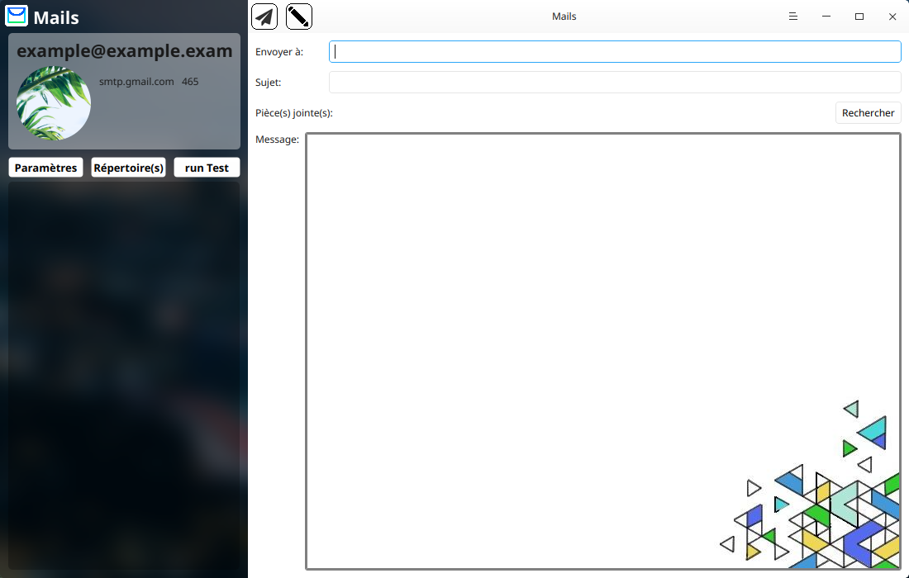

# Mail project for Deepin (designed for) #

        'Mails' (or 'Mail') is a beta of mail services based, for the moment on the SMTP system.

Please note the fact that this is a beta, a project in development, some things can don't work as expected (...). If you want to help this project and improve it, open an issue and put as title "(DEIH-Ask) Development, Enhance, Improvement and Help". This project is under GPU 3.0 License, Like all the other projects I have.

Project stopped for 3&⅝ weeks. 

App:
Major problem: Can read email's body, but can't select which one. You can check your 'INBOX' by entering your account informations and select 'run test', you'll see headers, and senders, you'll cannot see the body (content). In the future, the app will remove the settings area to create a new one using titlebar's option button, and (not sure) save data in config file.



## Dependencies
To build this project, you need the following developer packages (if there is):

*From dde-desktop:*
```
- libdtkcore
- libdtkwidget
- libdtkwm
```
*From Qt:*
```
- libqt5sql5
- libqt5sql5-mysql
- libqt5sql5-sqlite
- libqt5network5
- libqt5network5
```

## How to build the project
To build the Project, you need to run the following commands in the source directory:

```
$ qmake
$ make
```

## To build the translations
```
$ lrelease
```

## How to run
You can run the file by double-click and select 'run' or by typing:
```
$ ./mail
```

## Contact Us (Me)
Please begin title of the message with 'GH'.
```
n1coc4cola@gmail.com
```
My website (just for pc):
https://n1coc4cola.github.io/